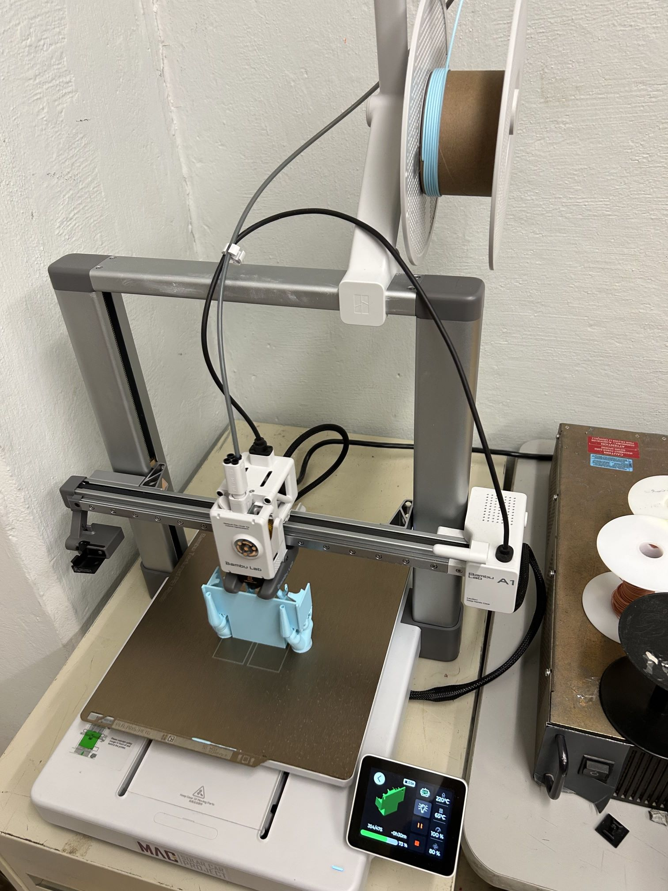
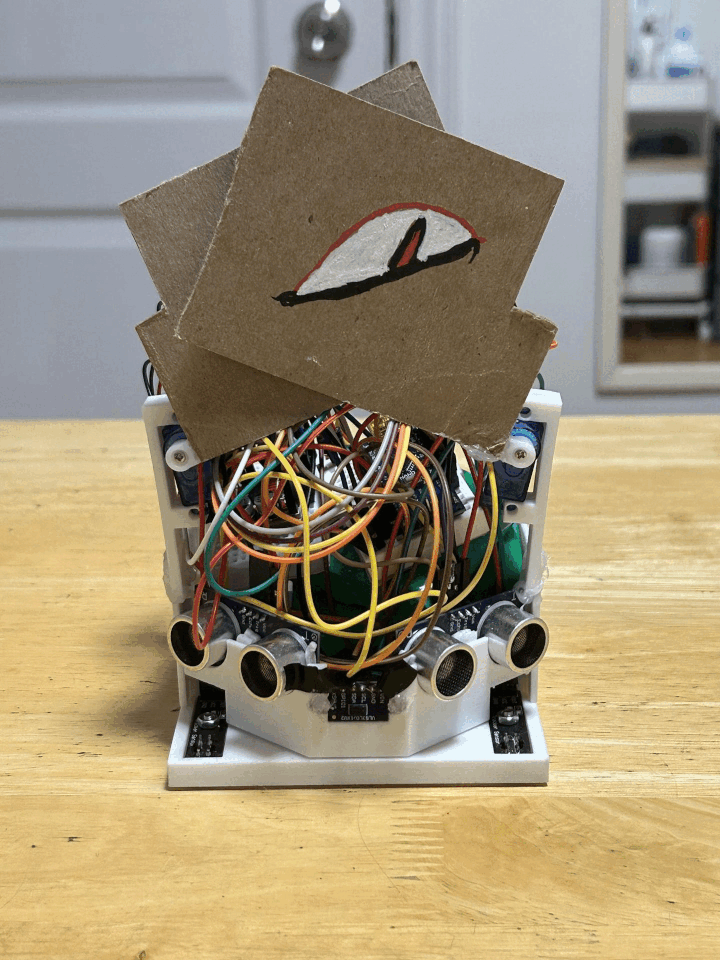

# Sumobot V2
As executives of the McMaster Sumobot Club, we were invited to participate at the Ontario Sumobot Competition hosted by UTRA at UofT.

The entire process of planning, prototyping, coding, and building took a few days to complete before we had a functional bot.

    

## Building Process
Our inital prototype included:
- Shell
- 2 IR sensors (line detection)
- 2 ultrasonic sensors + 1 TOF sensor (enemy detection)
- 2 DC motors + JSUMO steel wheels (crazy grip)
- Arduino Nano + motor driver
- 2 rechargeable battery packs
- 2 servos (added later)

    

Printing on the solar car club's Bambu Lab (without permission) and the printed result

    
    

Measurements were off, so we tried again.

    

Much better this time, bot starting to take shape

    
    

We also thought of the idea to add cardboard flaps to trick the enemy into driving through. Similar to this

    

We used 2 servos hot glued to cardboard. Due to size constraints (the bot had to be < 10x10 cm), we would have to have them retracted and fold out at the start of the battle.

Our inital setup went well:

    

Our testing run went better

    

## Final Result
The final result turned out great! We even painted the flaps to resemble eyes.

    

    
    
    

## Competition
The competition went well! We competed against teams from UofT, McMaster, and York. Despite some wiring complications with our bot, we still managed to do well. You win some and you lose some.

Some videos from the competiton:

    

