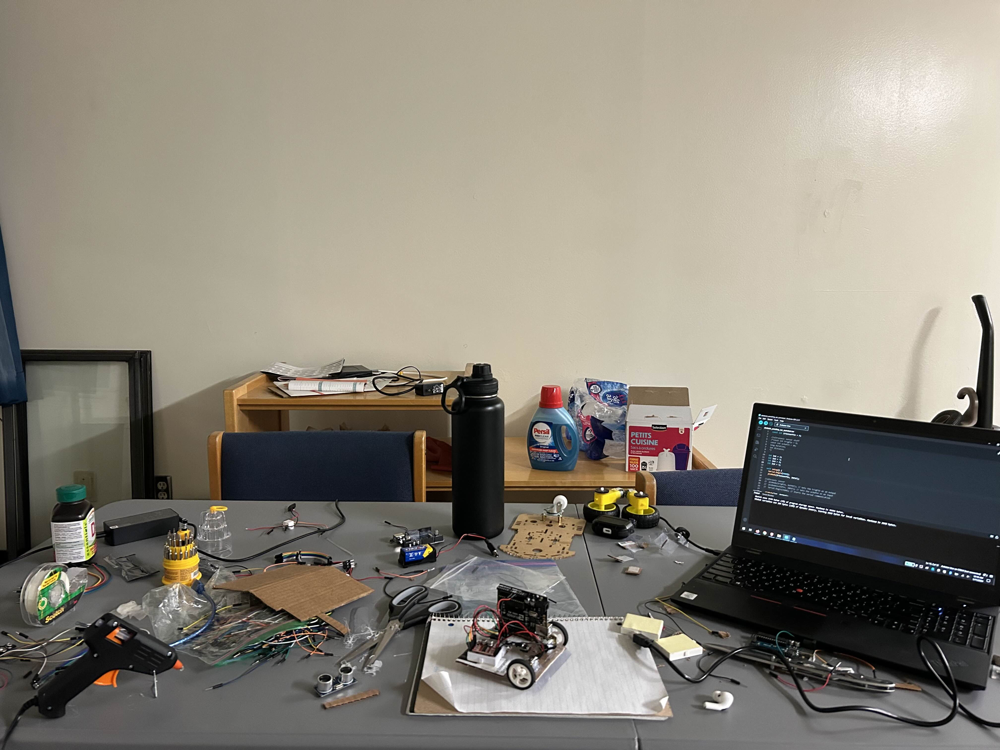

# McMaster Sumobot Project
In Jan 2024, I competed in the McMaster Sumobot Competition. The entire process of planning, prototyping, coding, and building took a few days to complete before we had a functional bot.

    <h3>Our bot in action:</h3>
    

### Building Process
We had access to bot building and coding resources, but did not know. As a result we put everything together ourselves with the little material we had (hence the cardboard). Had we known, our bot would have taken much less time to build and could be much better. You live and learn I guess.

    
    
    

### Prototypes
I prototyped several versions of code for different battle strategies, some more passive and some more aggressive. Check them out in the directories above.

    
    
    
    

### Final Result
The final result was too light! As a result we strapped 8 of the heaviest batteries we had on hand to it so that it would have a better chance pushing opponents and gripping the ground.

    
    
    
    
    
    <h3>Looking good!</h3>

